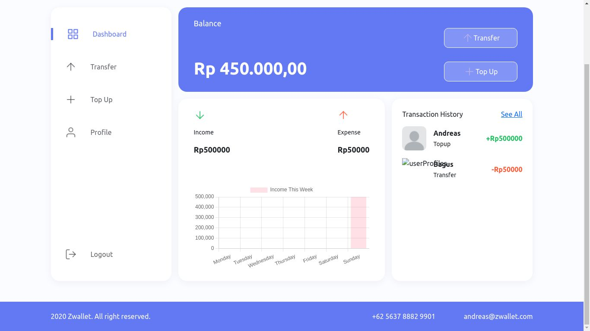
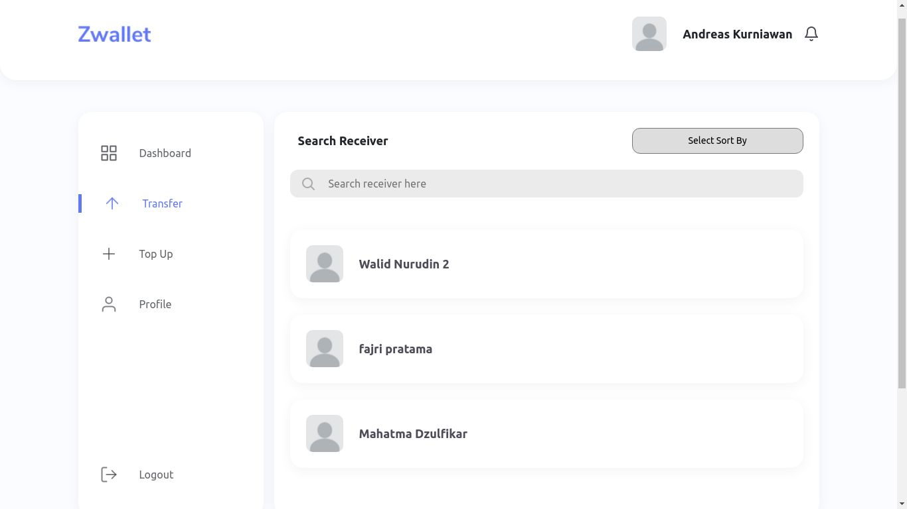

<div id="top"></div>
<!--
*** Thanks for checking out the Best-README-Template. If you have a suggestion
*** that would make this better, please fork the repo and create a pull request
*** or simply open an issue with the tag "enhancement".
*** Don't forget to give the project a star!
*** Thanks again! Now go create something AMAZING! :D
-->

<!-- PROJECT SHIELDS -->
<!--
*** I'm using markdown "reference style" links for readability.
*** Reference links are enclosed in brackets [ ] instead of parentheses ( ).
*** See the bottom of this document for the declaration of the reference variables
*** for contributors-url, forks-url, etc. This is an optional, concise syntax you may use.
*** https://www.markdownguide.org/basic-syntax/#reference-style-links
-->
<!-- [![Contributors][contributors-shield]][contributors-url]
[![Forks][forks-shield]][forks-url]
[![Stargazers][stars-shield]][stars-url]
[![Issues][issues-shield]][issues-url]
[![MIT License][license-shield]][license-url]
[![LinkedIn][linkedin-shield]][linkedin-url] -->

[![LinkedIn][linkedin-shield]][linkedin-url]

<!-- PROJECT LOGO -->
<br />
<div align="center">
  <!-- <a href="https://github.com/github_username/repo_name">
    
  </a> -->
  <h1 style="color:lightBlue; font-size:24px">ZWallet</h1>
<h3 align="center">
<a href='https://elated-swanson-6c1d50.netlify.app/'>
ZWallet</a>
</h3>
<p>Click text above to see the web<p>
<br>

  <!-- <p align="center">
    project_description
    <br />
    <a href="https://github.com/github_username/repo_name"><strong>Explore the docs »</strong></a>
    <br />
    <br />
    <a href="https://github.com/github_username/repo_name">View Demo</a>
    ·
    <a href="https://github.com/github_username/repo_name/issues">Report Bug</a>
    ·
    <a href="https://github.com/github_username/repo_name/issues">Request Feature</a>
  </p> -->
</div>

<!-- TABLE OF CONTENTS -->
<details>
  <summary>Table of Contents</summary>
  <ol>
    <li>
      <a href="#about-the-project">About The Project</a>
      <ul>
        <li><a href="#built-with">Built With</a></li>
      </ul>
    </li>
    <li>
      <a href="#getting-started">Getting Started</a>
      <ul>
        <li><a href="#prerequisites">Prerequisites</a></li>
        <li><a href="#installation">Installation</a></li>
      </ul>
    </li>
    <li><a href="#usage">Usage</a></li>
    <!-- <li><a href="#roadmap">Roadmap</a></li> -->
    <!-- <li><a href="#contributing">Contributing</a></li> -->
    <!-- <li><a href="#license">License</a></li> -->
    <li><a href="#contact">Contact</a></li>
    <!-- <li><a href="#acknowledgments">Acknowledgments</a></li> -->
  </ol>
</details>

<!-- ABOUT THE PROJECT -->

## About The Project

<center>
</img>
<!-- [landing page] -->

<br>
<br>
</img>
<!-- [movie list] -->

</center>

<br>
This project is a Local E-wallet, had function like other E-wallet like Transfer, Topup

<p align="right">(<a href="#top">back to top</a>)</p>

### Built With

  <!-- - [Vue.js](https://vuejs.org/) -->
  <!-- - [Angular](https://angular.io/) -->
  <!-- - [Svelte](https://svelte.dev/) -->
  <!-- - [Laravel](https://laravel.com) -->
<!-- - [JQuery](https://jquery.com) -->
<!-- - [React.js](https://reactjs.org/) -->
<!-- - [qrcode](https://www.npmjs.com/package/qrcode) -->

- [Next.js](https://nextjs.org/)
- [Bootstrap](https://getbootstrap.com)
- [Axios](https://www.npmjs.com/package/axios)
- [Chart.js](https://www.npmjs.com/package/chart.js)
- [dotenv](https://www.npmjs.com/package/dotenv)
- [moment](https://www.npmjs.com/package/qrcode)
- [react-bootstrap](https://react-bootstrap.github.io/)
- [react-bootstrap-icons](https://www.npmjs.com/package/react-bootstrap-icons)
- [redux-redux](https://www.npmjs.com/package/react-redux)
- [react-paginate](https://www.npmjs.com/package/react-paginate)
- [redux-persist](https://www.npmjs.com/package/redux-persist)

<p align="right">(<a href="#top">back to top</a>)</p>

<!-- GETTING STARTED -->

## Getting Started

Instalation Instruction

### Prerequisites

- npm
  ```sh
  npm install npm@latest -g
  ```

### Installation

1. Clone the repo
   ```sh
   git clone https://github.com/AndreasCKurniawan/Z-Wallet
   ```
2. Install NPM packages
   ```sh
   npm install
   ```
3. Run The Project
   ```sh
   npm run dev
   ```

<p align="right">(<a href="#top">back to top</a>)</p>

<!-- USAGE EXAMPLES -->

## Usage

For now ZWallet can you use for Local point. Like if you want to create some award for your employee based on how much point their have in their account. another example you can make that point to be a medium of exchange to another item in your building / area.

<p align="right">(<a href="#top">back to top</a>)</p>

<!-- ROADMAP -->

## Feature

- [] TopUp
- [] History Transaction
- [] Transfer money
- [] Receive money
- [] Payment gateway
- [] Edit Profile
- [] Export PDF Transaction
- [] etc.
<p align="right">(<a href="#top">back to top</a>)</p>

<!-- CONTRIBUTING -->

<!-- ## Contributing

Contributions are what make the open source community such an amazing place to learn, inspire, and create. Any contributions you make are **greatly appreciated**.

If you have a suggestion that would make this better, please fork the repo and create a pull request. You can also simply open an issue with the tag "enhancement".
Don't forget to give the project a star! Thanks again!

1. Fork the Project
2. Create your Feature Branch (`git checkout -b feature/AmazingFeature`)
3. Commit your Changes (`git commit -m 'Add some AmazingFeature'`)
4. Push to the Branch (`git push origin feature/AmazingFeature`)
5. Open a Pull Request

<p align="right">(<a href="#top">back to top</a>)</p> -->

<!-- LICENSE -->

<!-- ## License

Distributed under the MIT License. See `LICENSE.txt` for more information.

<p align="right">(<a href="#top">back to top</a>)</p> -->

<!-- CONTACT -->

## Contact

AndreasCKurniawan - andreasckurniawan03@gmail.com

Project Link: [https://github.com/AndreasCKurniawan/Z-Wallet](https://github.com/AndreasCKurniawan/Z-Wallet)

<p align="right">(<a href="#top">back to top</a>)</p>

<!-- ACKNOWLEDGMENTS -->

<!-- ## Acknowledgments

- []()
- []()
- []() -->

<!-- <p align="right">(<a href="#top">back to top</a>)</p> -->

<!-- MARKDOWN LINKS & IMAGES -->
<!-- https://www.markdownguide.org/basic-syntax/#reference-style-links -->

[contributors-shield]: https://img.shields.io/github/contributors/github_username/repo_name.svg?style=for-the-badge
[contributors-url]: https://github.com/github_username/repo_name/graphs/contributors
[forks-shield]: https://img.shields.io/github/forks/github_username/repo_name.svg?style=for-the-badge
[forks-url]: https://github.com/github_username/repo_name/network/members
[stars-shield]: https://img.shields.io/github/stars/github_username/repo_name.svg?style=for-the-badge
[stars-url]: https://github.com/github_username/repo_name/stargazers
[issues-shield]: https://img.shields.io/github/issues/github_username/repo_name.svg?style=for-the-badge
[issues-url]: https://github.com/github_username/repo_name/issues
[license-shield]: https://img.shields.io/github/license/github_username/repo_name.svg?style=for-the-badge
[license-url]: https://github.com/github_username/repo_name/blob/master/LICENSE.txt
[linkedin-shield]: https://img.shields.io/badge/-LinkedIn-black.svg?style=for-the-badge&logo=linkedin&colorB=555
[linkedin-url]: https://www.linkedin.com/in/andreas-kurniawan
[product-screenshot]: images/1.jpg
[product-screenshot2]: images/2.jpg

```

```
